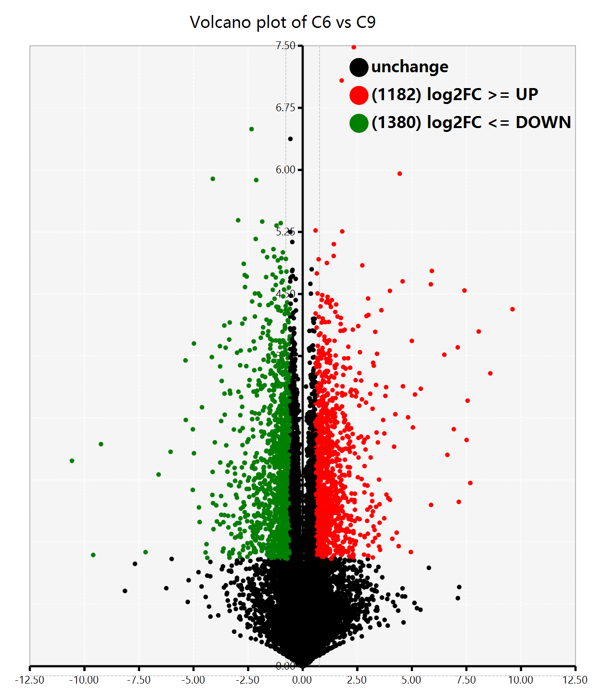
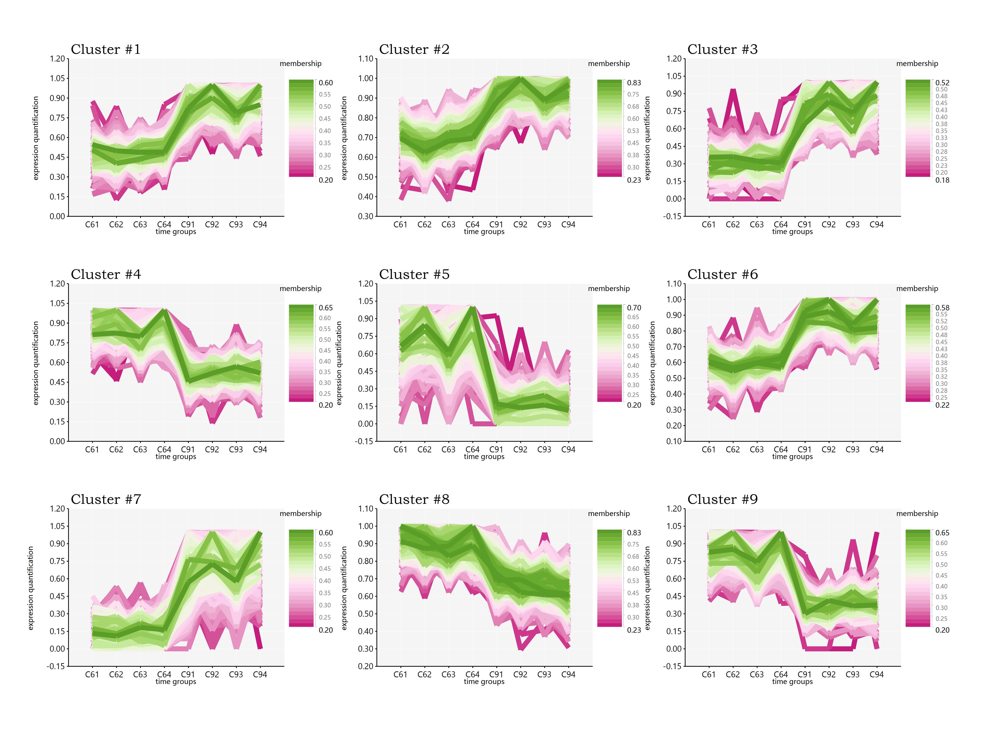

# label-free
 
## Analysis Contents

### 1. raw data summary

+ heatmap
+ consistency scatter plot
+ GO annotation plot
+ KO annotation plot

### 2. stat analysis

+ PCA
   + PCA2D
   + PCA loading

### 3. DEP analysis

+ t.test
+ volcano
   
+ z_score
+ kmeans plot

### 4. biological cluster analysis

+ heatmap of DEP
+ Cmeans patterns
   
+ enrichment

### 5. PPI analysis

+ correlation network
+ enrichment
